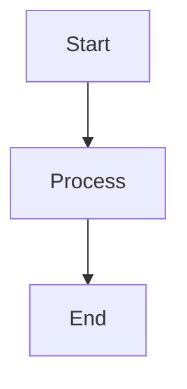
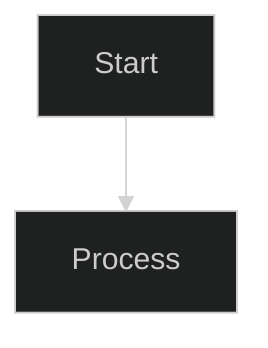
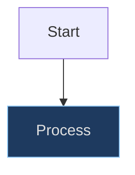

# Mermaid Diagram Theming

Never put a `%%{init: {'theme': '...'}}%%` directive in any markdown file, and never hardcode hex
colors in an inline `style` line. Every renderer this project targets already picks a theme from the
reader's preference, and a per-diagram directive overrides that for everyone.

## Who renders diagrams

| Location    | Renderer        | Theme source                                                 |
| ----------- | --------------- | ------------------------------------------------------------ |
| `docs/`     | MkDocs Material | The site palette, through Material's own mermaid integration |
| `README.md` | GitHub, VS Code | `prefers-color-scheme`                                       |
| Any `.md`   | Anything else   | Whatever that renderer decides                               |

In `docs/`, the `pymdownx.superfences` custom fence in `mkdocs.yml` turns a ` ```mermaid ` block
into `<pre class="mermaid">`, which is exactly the markup Material's built-in diagram support looks
for. Material then:

1. Loads `mermaid.min.js` from unpkg only on pages that contain a diagram.
1. Calls `mermaid.initialize` with a `themeCSS` built from 26 `--md-mermaid-*` CSS custom
   properties.
1. Re-renders on a palette toggle.

Those custom properties default to `--md-accent-fg-color`, `--md-code-fg-color`, and
`--md-default-bg-color`, all of which `docs/stylesheets/extra.css` already redefines per scheme. So
diagrams follow the DxMessaging palette in both light and dark with no diagram-specific CSS. To
retint them, override a `--md-mermaid-*` property in `extra.css`; see
[changing the colors](https://squidfunk.github.io/mkdocs-material/setup/changing-the-colors/).

### There is no custom mermaid script

`docs/javascripts/mermaid-config.js` used to do this job and was deleted (issue #299). It loaded the
mermaid bundle (3,565,102 bytes raw, 948 KB gzipped) through `extra_javascript`, which put it on 48
of the site's 49 pages when only 6 render a diagram, and it rendered every diagram a second time
because Material's integration was already handling the same elements. Do not reintroduce a
`extra_javascript` mermaid entry.

## Why a per-diagram directive is wrong

A directive pins one theme for every reader:

- A `dark` diagram on a light page is low-contrast text on a pale background.
- It overrides Material's palette toggle, so one diagram stops matching the page the moment the
  reader switches schemes.
- It overrides `prefers-color-scheme` on GitHub, which is where most readers see `README.md`.

Correct, in every file:

````markdown

````

Forbidden, in every file:

````markdown

````

`'theme': 'forest'` and every other value are equally forbidden. The rule is about pinning a theme,
not about which one gets pinned.

## Inline style directives

Mermaid also accepts per-node styling:



Those hex values are chosen against one background, so the node inverts badly in the other scheme.
Prefer no inline styles at all. If a diagram genuinely needs to distinguish one node, check the
result in both schemes before committing it.

## Validation

```bash
grep -rn --include='*.md' "%%{init.*theme" .
```

No output means clean. Any hit is the exact line to delete.

## See Also

- [Markdown Compatibility Guidelines](./markdown-compatibility.md) - the rest of the forbidden
  MkDocs-specific syntax.
- [Documentation Style Guide](../../documentation-style/references/documentation-style-guide.md) -
  prose and formatting rules.
- [Mermaid theming reference](https://mermaid.js.org/config/theming.html) - upstream documentation
  for the theme variables Material sets.
