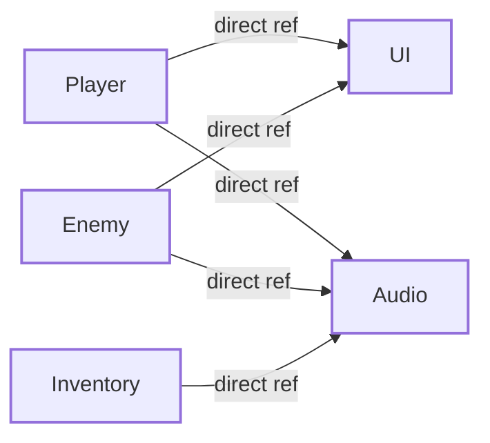
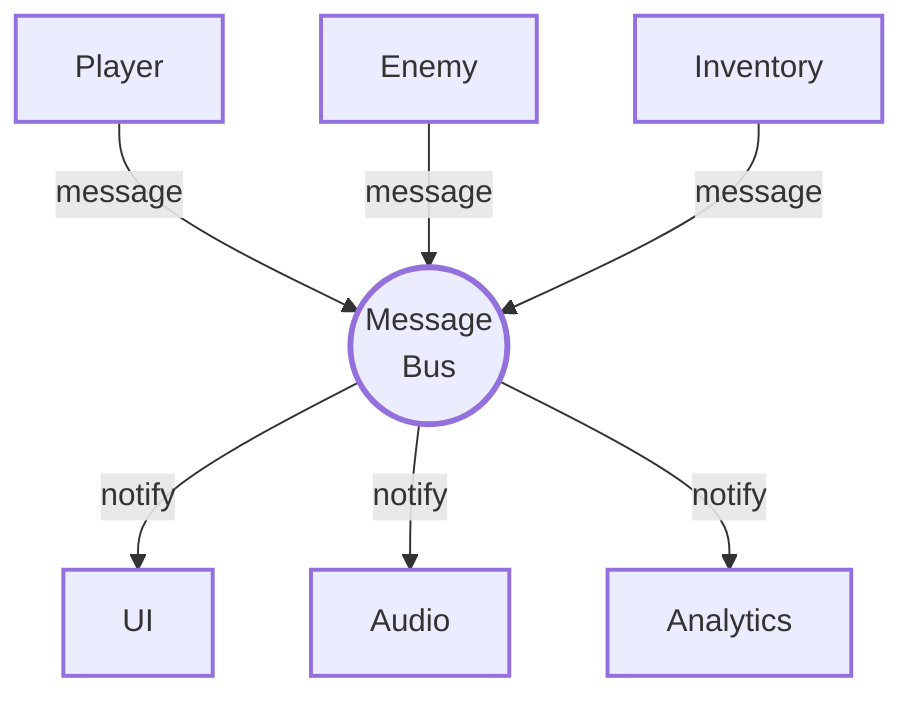
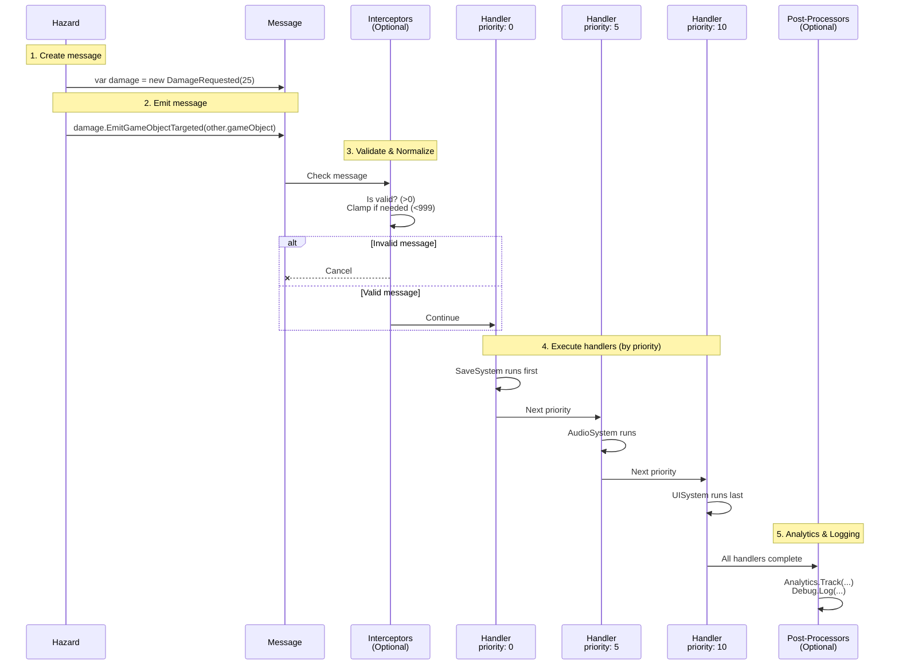
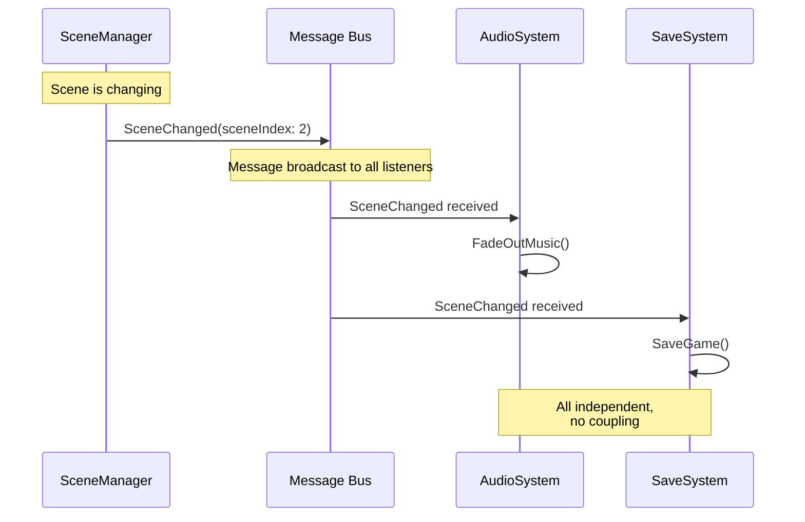
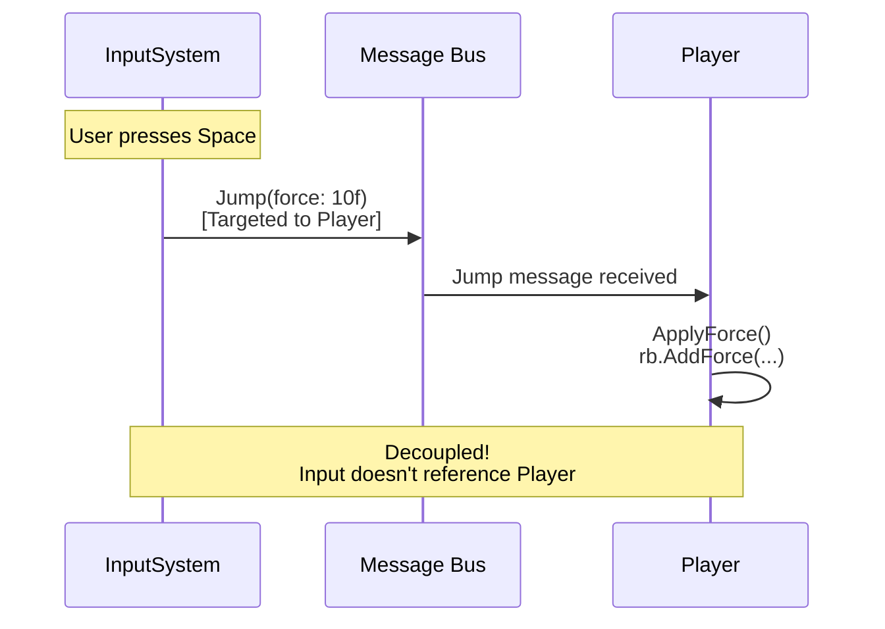
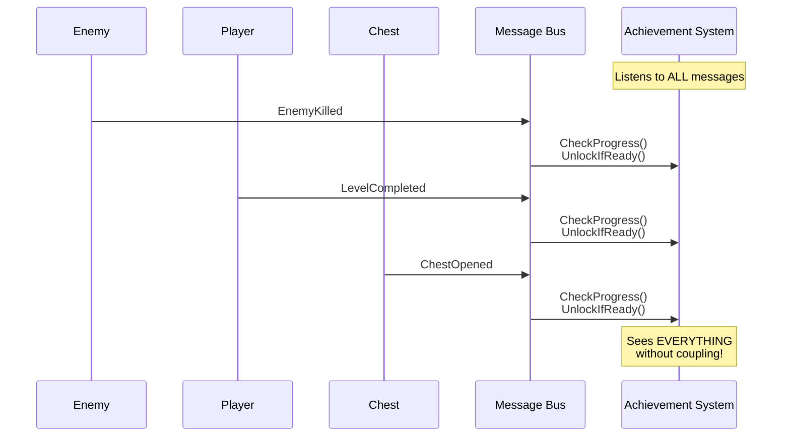
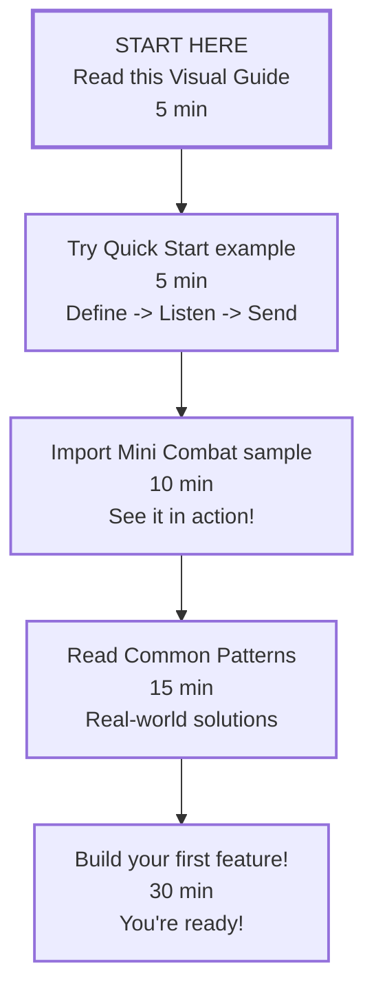

# DxMessaging Visual Guide for Beginners

If you're brand new to messaging systems, this visual guide will help you understand DxMessaging in minutes.

## What Problem Does It Solve

### The Old Way (Spaghetti Code)



#### Problems

- Everyone needs to know everyone else
- Hard to add/remove systems
- Memory leaks from forgotten unsubscribes

### The DxMessaging Way (Clean Separation)



#### Benefits

- Nobody knows about anyone else
- Easy to add/remove systems
- Automatic cleanup (prevents common leaks)

## The Three Message Types (Simple!)

Think of messages like different kinds of mail:

### 1. Untargeted (Announcement to Everyone)

Like a megaphone announcement in a stadium - everyone hears it.

```csharp
// Define the announcement
[DxUntargetedMessage]
[DxAutoConstructor]
public readonly partial struct GamePaused { }

// Anyone can announce
var msg = new GamePaused();
msg.Emit();

// Anyone can listen
_ = token.RegisterUntargeted<GamePaused>(OnPause);
```

#### Real-world uses

- "Game paused!"
- "Settings changed!"
- "Level loaded!"

### 2. Targeted (Letter to One Person)

Like mailing a letter to a specific address - only that recipient gets it.

```csharp
// Define the letter
[DxTargetedMessage]
[DxAutoConstructor]
public readonly partial struct Heal { public readonly int amount; }

// Send to specific person
var heal = new Heal(50);
heal.EmitGameObjectTargeted(playerObject);

// Only the player listens
_ = token.RegisterComponentTargeted<Heal>(this, OnHeal);
```

#### Real-world uses

- "Player, heal yourself!"
- "Enemy #3, take damage!"
- "Button, update your text!"

### 3. Broadcast (News from One Source)

Like a news broadcast - comes from one source, anyone can tune in.

```csharp
// Define the news
[DxBroadcastMessage]
[DxAutoConstructor]
public readonly partial struct TookDamage { public readonly int amount; }

// Broadcast from this object
var dmg = new TookDamage(25);
dmg.EmitGameObjectBroadcast(gameObject);

// UI can listen to this source
_ = token.RegisterGameObjectBroadcast<TookDamage>(gameObject, OnThisDamage);

// OR achievement system can listen to ALL enemies
_ = token.RegisterBroadcastWithoutSource<TookDamage>(OnAnyEnemy);
```

#### Real-world uses

- "I (player) took damage!"
- "I (enemy) died!"
- "I (chest) was opened!"

## The Message Journey (Step by Step)

When you send a message, here's what happens:



### Key points

- **Step 1-2:** You create and emit the message
- **Step 3 (Optional):** Interceptors can validate, modify, or cancel
- **Step 4:** Handlers run in priority order (lower number = earlier)
- **Step 5 (Optional):** Post-processors run after everything (suitable for analytics)

## Your First Message (3 Easy Steps)

### Step 1: Define It

```csharp
using DxMessaging.Core.Attributes;

[DxTargetedMessage]     // <- What kind of message?
[DxAutoConstructor]     // <- Auto-make a constructor
public readonly partial struct DamageRequested
{
    public readonly int Amount;
}
```

#### What are those `[DxSomething]` tags?

These attributes declare generated message behavior at compile time:

- **`[DxTargetedMessage]`** - Adds the targeted message interfaces and identity used by DxMessaging; the library supplies the emit extension methods
- **`[DxAutoConstructor]`** - Generates a constructor that initializes all fields

For example, `[DxAutoConstructor]` generates this constructor automatically:

```csharp
public DamageRequested(int Amount)
{
    this.Amount = Amount;
}
```

**Why `partial`?** The `partial` keyword allows the source generator to add the generated code to your type in a separate file during compilation.

**Want to learn more?** See [Helpers & Source Generation](../reference/helpers.md) for the full explanation!

### Step 2: Listen for It

```csharp
using DxMessaging.Unity;
using UnityEngine;

public sealed class DamageReceiver : MessageAwareComponent
{
    public int Health { get; private set; } = 100;

    protected override void RegisterMessageHandlers()
    {
        base.RegisterMessageHandlers();
        _ = Token.RegisterGameObjectTargeted<DamageRequested>(gameObject, OnDamageRequested);
    }

    private void OnDamageRequested(in DamageRequested message)
    {
        Health = Mathf.Max(0, Health - Mathf.Max(0, message.Amount));
    }
}
```

**Automatic:** `MessageAwareComponent` handles all the lifecycle automatically.

- Creates registration in `Awake()`
- Activates in `OnEnable()`
- Deactivates in `OnDisable()`
- Cleans up in `OnDestroy()`

> **Important**: If you override `Awake`, `OnEnable`, `OnDisable`, `OnDestroy`, or `RegisterMessageHandlers` on a `MessageAwareComponent`, call `base.X()` first or your handlers stop working silently. See the [analyzer reference](../reference/analyzers.md#dxmsg006-missing-base-call).

### Step 3: Send It

```csharp
using DxMessaging.Core.Extensions;
using UnityEngine;

public sealed class Hazard : MonoBehaviour
{
    public int Damage = 25;

    private void OnTriggerEnter(Collider other)
    {
        DamageRequested request = new DamageRequested(Damage);
        request.EmitGameObjectTargeted(other.gameObject);
    }
}
```

On the hazard GameObject, enable **Is Trigger** on its collider and add a kinematic `Rigidbody` with
**Use Gravity** disabled. Put `DamageReceiver` and the entering collider on the same target
GameObject. The trigger provides that exact target, so `Hazard` does not need a player reference.

## Common Patterns Visualized

### Pattern: Scene Transition



**Why this works:** AudioSystem and SaveSystem don't know about SceneManager or each other. They just listen for `SceneChanged` messages and react independently.

Code:

```csharp
// Define
[DxUntargetedMessage]
[DxAutoConstructor]
public readonly partial struct SceneChanged { public readonly int sceneIndex; }

// Anyone can send
var msg = new SceneChanged(2);
msg.Emit();

// Many can listen independently
_ = audioToken.RegisterUntargeted<SceneChanged>(OnScene);
_ = saveToken.RegisterUntargeted<SceneChanged>(OnScene);
```

### Pattern: Player Input -> Action



**Why this works:** InputSystem doesn't need a reference to Player. It just sends a `Jump` message targeted at the player, and the player responds.

Code:

```csharp
// Input system (doesn't know about Player!)
void Update() {
    if (Input.GetKeyDown(KeyCode.Space)) {
        var jump = new Jump(10f);
        jump.EmitComponentTargeted(playerController);
    }
}

// Player (doesn't know about Input system!)
_ = token.RegisterComponentTargeted<Jump>(this, OnJump);
void OnJump(in Jump msg) {
    rb.AddForce(Vector3.up * msg.force, ForceMode.Impulse);
}
```

### Pattern: Achievement Tracking



**Why this works:** Achievement System uses `RegisterGlobalAcceptAll()` to observe every message type, tracking progress across the entire game without any system knowing about it.

Code:

```csharp
public class AchievementSystem : MessageAwareComponent {
    protected override void RegisterMessageHandlers() {
        base.RegisterMessageHandlers();
        // Listen to EVERYTHING
        _ = Token.RegisterGlobalAcceptAll(
            (in IUntargetedMessage m) => Check(m),
            (in InstanceId t, in ITargetedMessage m) => Check(m),
            (in InstanceId s, in IBroadcastMessage m) => Check(m)
        );
    }
}
```

## When to Use Which Message Type

### Use Untargeted When

- Global game state changes (pause, settings, scene load)
- System-wide announcements
- Configuration updates

### Use Targeted When

- Commanding a specific object ("You, do this!")
- UI updates for specific elements
- Direct communication (A -> B)

### Use Broadcast When

- Events others should know about ("I did this!")
- Analytics tracking
- Achievement triggers
- Notifications from specific sources

## Mental Model: Restaurant Analogy

Think of DxMessaging like a restaurant:

### Untargeted = Restaurant Announcement

to "Attention all customers: We're closing in 10 minutes!"

> to -> Everyone hears it

### Targeted = Waiter Delivering Food

to "Order for table 5: Here's your burger"

> to -> Only table 5 gets it

### Broadcast = Customer Calling Waiter

to "Excuse me, I need a refill!" (from table 3)

> to -> Comes from table 3
>
> to -> Any available waiter can respond
>
> to -> Manager might track it for statistics

## Debugging Visualized

DxMessaging has three built-in Editor views for message flow.

### Message Monitor

Inspect recent emissions by route kind, message type, and context. Select an
entry to inspect its call site.

### Flow Graph

Inspect loaded-scene `MessagingComponent` topology, route activity, and delivery
evidence. Direct bus or token registrations outside those components do not
appear in this graph.

### MessagingComponent Inspector

Inspect component-local registrations, buffers, provider warnings, and missing
base-call diagnostics. See the [Diagnostics guide](../guides/diagnostics.md) for
screenshots and the complete workflow.

## Performance at a Glance

| Metric       | Traditional C# Events | DxMessaging                                                                        |
| ------------ | --------------------- | ---------------------------------------------------------------------------------- |
| **Speed**    | Direct callback path  | [Current CI results](../architecture/performance.md#latest-ci-performance-results) |
| **Memory**   | Can leak!             | Automatic cleanup (struct messages)                                                |
| **Coupling** | Tight coupling        | Zero coupling                                                                      |

**Bottom line:** It adds routing work compared with raw events, but:

- Prevents common memory leaks
- Zero coupling
- Full observability
- Predictable ordering

## Learning Path



## Common Beginner Questions

### "Do I always need MessageAwareComponent?"

**For Unity:** Yes! It's the easiest way. Think of it like `MonoBehaviour` - you inherit from it and it handles all the messy lifecycle stuff automatically.

**For pure C#:** No, you can use `MessageRegistrationToken` directly if you're not in Unity.

**Bottom line:** If you're in Unity, use `MessageAwareComponent`. It handles subscription lifecycle automatically, which can reduce debugging related to memory leaks.

### "Can I send a message to multiple targets?"

**No** - Targeted messages go to ONE specific entity (like mailing a letter to one address).

#### Instead, use

- **Untargeted** if literally everyone should hear it (like a megaphone announcement)
- **Broadcast** if it's from one source and many can observe (like a news broadcast)

##### Example

```csharp
// DON'T: Try to target multiple entities
msg.EmitComponentTargeted(player1);
msg.EmitComponentTargeted(player2);  // Feels wrong, right?

// DO: Use broadcast so everyone can listen
msg.EmitGameObjectBroadcast(gameObject);  // Now anyone can observe this source
```

### "What if I forget to unsubscribe?"

#### The system handles cleanup automatically

When your component is destroyed, DxMessaging cleans up registrations for you. No `OnDestroy()` needed. This reduces the likelihood of common memory leak patterns.

#### Old way (easy to forget)

```csharp
void OnEnable() { GameManager.OnScoreChanged += Update; }
void OnDisable() { GameManager.OnScoreChanged -= Update; }  // Forgot this? LEAK!
```

##### DxMessaging way (automatic management)

```csharp
protected override void RegisterMessageHandlers() {
    base.RegisterMessageHandlers();
    _ = Token.RegisterUntargeted<ScoreChanged>(Update);
}
// Automatic cleanup when component is destroyed.
```

### "Is it slower than regular events?"

It has more routing work than a direct callback. Read the
[current CI results](../architecture/performance.md#latest-ci-performance-results)
for the measured cost on the published runner; do not rely on a fixed overhead
because the difference changes by scenario, subscriber count, and backend.

That cost buys automatic lifecycle, cleanup, observability, and predictable
ordering when those features matter.

### "Can I cancel a message?"

#### Yes! That's what interceptors are for

```csharp
// Cancel invalid damage
_ = token.RegisterTargetedInterceptor<ApplyDamage>(
    (ref InstanceId target, ref ApplyDamage msg) => {
        if (msg.amount <= 0) return false;  // Cancel invalid damage
        if (IsInvincible(target)) return false;  // Cancel during invincibility
        return true;  // Allow
    }
);
```

##### Real-world uses

- Block input during cutscenes
- Cancel damage when invincible
- Prevent cheating (clamp values)
- Enforce game rules globally

### "Can I see what messages are firing?"

#### Yes. Open Message Monitor and Flow Graph

You'll see:

- Message Monitor shows recent emissions, contexts, filters, and captured call sites.
- Flow Graph shows loaded-scene `MessagingComponent` routes, receivers, call
  counts, and delivery evidence. Use bus logs or counters for direct token or bus
  registrations outside those components.
- The Inspector shows component-local registrations and lifecycle warnings.

**No more guessing.** You can literally see your event flow in real-time.

## Quick Checklist: Am I Doing It Right

- [ ] Using `MessageAwareComponent` for Unity components?
- [ ] Defining messages as `readonly struct`?
- [ ] Using `[DxAutoConstructor]` to avoid boilerplate?
- [ ] Storing struct in variable before emitting?
- [ ] Choosing the right message type (Untargeted/Targeted/Broadcast)?
- [ ] Using GameObject/Component emit helpers?

If you checked all these, you are following best practices.

## Next Steps

Ready for more?

1. **[Mental Model](../concepts/mental-model.md)** - Understand the philosophy
1. **[Getting Started Guide](getting-started.md)** - Full guide with more details
1. **[Common Patterns](../guides/patterns.md)** - Real-world examples
1. **[Message Types](../concepts/message-types.md)** - When to pick Untargeted, Targeted, or Broadcast
1. **[Diagnostics](../guides/diagnostics.md)** - Use Message Monitor, Flow Graph, and the Inspector

---

**Summary:** DxMessaging provides a structured approach to inter-component communication. You define the message, specify recipients, and the system handles delivery.
