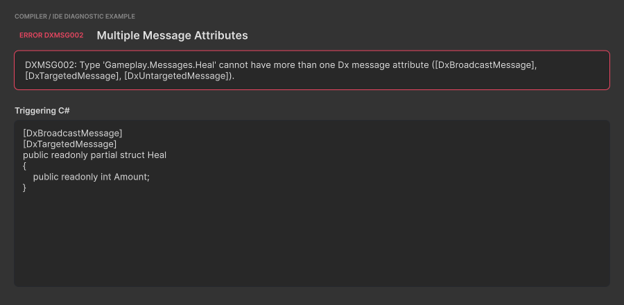
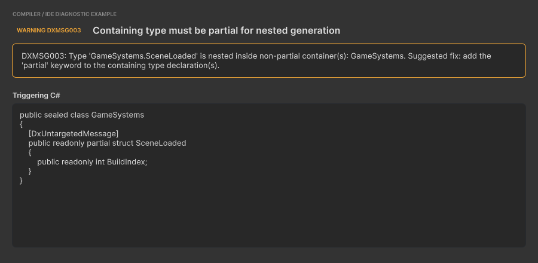
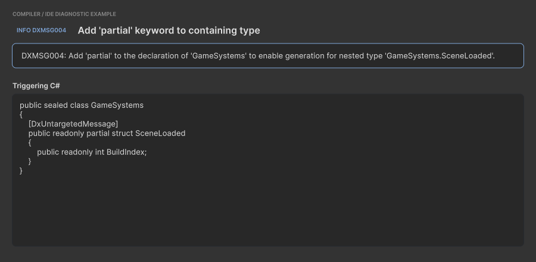
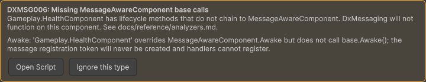
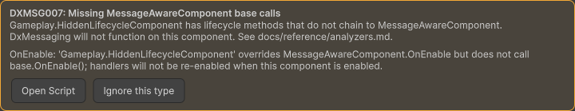
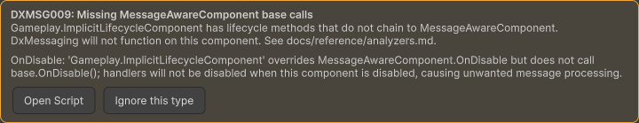
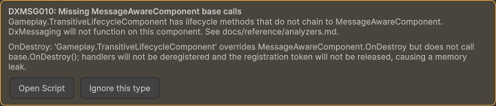
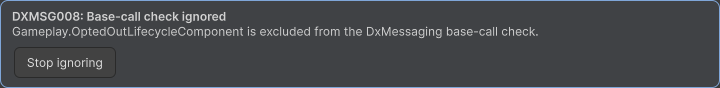
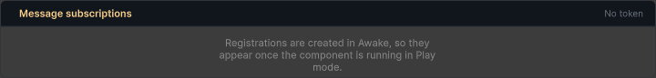
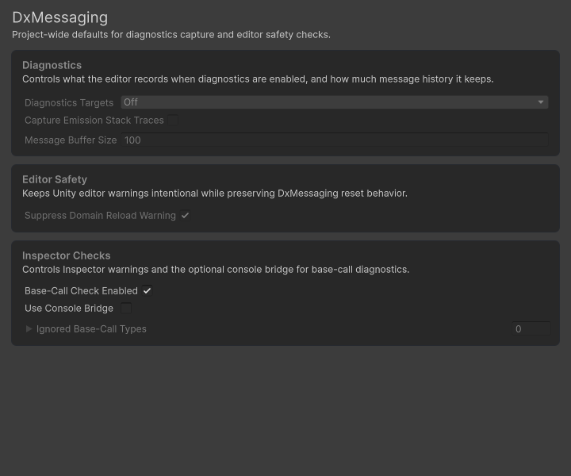

# Inspector Overlay & Base-Call Warnings

DxMessaging ships a Roslyn analyzer and a companion Unity Inspector overlay
that catch the most common authoring mistake when subclassing
`MessageAwareComponent`: forgetting to call `base.OnEnable()` (and friends)
in your override. Without those base calls the messaging system does
nothing -- every handler you registered silently fails to fire. This page
is the user-facing tour of how the package surfaces the problem and how
you fix it.

This guide covers when warnings appear, what the Inspector warning surfaces
look like, the three actions they offer, the Project Settings panel, and the
manual rescan menu. For the full reference -- every diagnostic id,
exact detection policy, suppression precedence, and Unity 2021 setup
notes -- see [Roslyn Analyzers & Diagnostics](../reference/analyzers.md).

The current diagnostic catalog starts at `DXMSG002`; no `DXMSG001` is assigned.
`DXMSG002` through `DXMSG005` are compiler and source-generator diagnostics, so
they appear in Unity's Console or the IDE rather than in this Inspector overlay.
The overlay covers `DXMSG006` through `DXMSG010`.

## Compiler Diagnostics Before the Overlay

| ID         | Severity | Trigger                                                        |
| ---------- | -------- | -------------------------------------------------------------- |
| `DXMSG001` | -        | Unassigned. The package does not emit this diagnostic.         |
| `DXMSG002` | Error    | One type has more than one Dx message-shape attribute.         |
| `DXMSG003` | Warning  | A generated nested type has a non-`partial` containing type.   |
| `DXMSG004` | Info     | Companion suggestion to add `partial` to that containing type. |

The following deterministic specimens pair the exact compiler output with the
C# declaration that triggers it. They use the package capture theme so the text
is readable and repeatable; they do not imitate Unity Console or IDE chrome.

### DXMSG002: multiple message attributes



Choose exactly one of `DxBroadcastMessage`, `DxTargetedMessage`, or
`DxUntargetedMessage` for each message type.

### DXMSG003: non-partial containing type



### DXMSG004: add partial suggestion



`DXMSG003` and `DXMSG004` intentionally point at the same declaration. Add
`partial` to every containing type to resolve both diagnostics. See the
[analyzer reference](../reference/analyzers.md#dxmsg003-containing-type-must-be-partial-for-nested-generation)
for complete fixes and edge cases.

## When a Warning Appears

Whenever your code triggers one of the base-call diagnostics
([DXMSG006](../reference/analyzers.md#dxmsg006-missing-base-call),
[DXMSG007](../reference/analyzers.md#dxmsg007-new-hides-unity-method),
[DXMSG009](../reference/analyzers.md#dxmsg009-implicit-hide-and-missing-modifier),
or [DXMSG010](../reference/analyzers.md#dxmsg010-broken-transitive-base-call-chain)),
two things happen in parallel:

1. **At compile time**, the Roslyn analyzer (`WallstopStudios.DxMessaging.Analyzer.dll`,
   shipped under `Runtime/Analyzers/`) emits a warning into Unity's
   Console with the corresponding `DXMSG###` id and a message that
   names the offending type and method.
1. **At Inspector time**, the overlay reads the cached scan from
   `Library/DxMessaging/baseCallReport.json` and renders a warning
   panel at the very top of every `MessageAwareComponent` subclass's
   Inspector that has at least one missing base call.

You see both surfaces by default. The Console warning is authoritative
for CI builds (the analyzer is activated for Unity's C# compiler through
the `RoslynAnalyzer` label, so it runs on every Unity-driven compile);
the Inspector overlay is the in-Editor reminder you cannot ignore while
wiring a prefab.

> **Tip**: Severity is per-project tunable. Add lines like
> `dotnet_diagnostic.DXMSG006.severity = error` to your `.editorconfig` to
> upgrade missing base calls into a build break, or `severity = none` to
> silence one project-wide. See
> [Suppression precedence](../reference/analyzers.md#suppression-precedence)
> for the full ordering.

## The Warning Surfaces

When the overlay decides to render for the normal DxMessaging-owned
component inspector, it draws a compact UI Toolkit panel above your
component's Inspector body, followed by a horizontal row of action
buttons. User-defined custom editors for specific `MessageAwareComponent`
subclasses keep their normal inspector body; the package injects the
same warning data through Unity's component-header hook as an IMGUI
HelpBox so the user's editor can stay in charge of its body.

The title includes the contributing diagnostic ID. An aggregated report sorts
and deduplicates multiple IDs before rendering them.

### DXMSG006: missing base call



### DXMSG007: explicit lifecycle hide



### DXMSG009: implicit lifecycle hide



### DXMSG010: broken transitive chain



The panel follows this shape:

- **Title:** `DXMSG###: Missing MessageAwareComponent base calls`
- **Body:** `<FullyQualifiedTypeName> has lifecycle methods that do not chain to MessageAwareComponent. DxMessaging will not function on this component.`
- **Method list:** one row per missing method, such as `OnEnable:
'<type>' overrides MessageAwareComponent.OnEnable but does not call
base.OnEnable(); handlers will not be re-enabled when this component
is enabled.`

When the cache is stale (immediately after a domain reload, before the
first post-reload scan completes), the panel includes a
`Report is cached from previous session; refreshing...` line -- see
[Cached-from-previous-session annotation](#cached-from-previous-session-annotation)
below.

The custom-editor IMGUI path uses Unity's native `HelpBox` instead of
the retained UI Toolkit panel. Its text names the fully-qualified type,
lists the missing methods, includes the same per-method consequence
lines, points to `docs/reference/analyzers.md`, and appends
`(cached from previous session; refreshing...)` while the cache is stale.
It exposes the same **Open Script** and **Ignore this type** actions.

The method list is taken straight from the analyzer's per-type report
-- typically one of `Awake`, `OnEnable`, `OnDisable`, `OnDestroy`, or
`RegisterMessageHandlers`. A single component can list multiple methods
if more than one override is broken.

### Cached-from-previous-session annotation

After a domain reload -- when you enter Play Mode, recompile, or open the
Editor -- the overlay needs a moment to rebuild its scan. Rather than
flashing an empty Inspector and then suddenly showing a warning, the
package eagerly loads the previous session's cache from
`Library/DxMessaging/baseCallReport.json` so the warning is visible
immediately.

While that cached data is being refreshed, the warning panel includes
the stale-cache note `Report is cached from previous session;
refreshing...`. The IMGUI header-hook path appends
`(cached from previous session; refreshing...)` to the HelpBox body
instead.

Once the first post-reload scan completes (typically within a single
editor tick after assembly reload completes), the harvester flips its
`IsFreshThisSession` flag and the note disappears. You do not need to
do anything -- the Inspector repaints automatically. The annotation
exists so you understand the data is from the previous session in the
unlikely event you have just edited the offending source code and the
Inspector is showing a warning that the latest compile would have
fixed.

## Three Inspector Actions

Below the warning surface the overlay draws a horizontal action row.
The buttons that appear depend on whether the component's
fully-qualified type name is currently in the project ignore list.

### Default (warning) state

When the component is **not** ignored, you see two buttons:

- **Open Script** -- opens the offending component's source file at the
  top; when the legacy console bridge is enabled and a line number is
  available, the file opens at that line.
- **Ignore this type** -- appends the component's fully-qualified type
  name to the ignore list in `Assets/Editor/DxMessagingSettings.asset`;
  the generated sidecar is refreshed for the analyzer. The next
  Inspector repaint flips the overlay into its info shape (below).
  The mutation is deferred to the next editor frame so the current GUI
  cycle completes cleanly -- there is no perceptible delay.

### Ignored state

When the component **is** in the ignore list, the overlay shows the info
shape -- the type is explicitly excluded from the base-call check -- and
the action row collapses to a single button:



- **Stop ignoring** -- removes the component's fully-qualified type
  name from the ignore list. The ignored info state clears on the next
  repaint; if the type still violates the rule, the warning returns
  after the next fresh scan, compile, or manual rescan.

> **Warning**: Adding a type to the ignore list silences the **overlay** and the
> compile-time base-call analyzer for that type, but it does not change the
> runtime behaviour. If the override genuinely never reaches `base.OnEnable()`,
> the messaging system on that component is still dead. For finer-grained
> control, the source-level
> `[DxMessaging.Core.Attributes.DxIgnoreMissingBaseCall]` attribute suppresses
> the analyzer at the class or method level and is checked **before** the
> project ignore list. See the
> [suppression precedence ordering](../reference/analyzers.md#suppression-precedence)
> for the full priority. Use either suppression path only when the silencing is
> intentional (for example, a deliberate adapter that should not participate
> in messaging), and document the reason for your team.

## Message Subscriptions

Below the serialized fields, the package's `MessageAwareComponent` inspector shows
a **Message subscriptions** section listing the registrations that component's
`MessageRegistrationToken` currently holds. It reads the live token, so it
answers "is this component actually listening, and to what?" without adding a
log statement. A subclass with its own `[CustomEditor]` draws that editor instead,
so the section does not appear there; the base-call warning above still does,
through the header hook.



Each row shows:

- The message type name.
- The registration kind (`Untargeted`, `Targeted`, `Broadcast`, a post-processor
  or interceptor variant) and the registration priority.
- The observed call count, or `calls n/a` when diagnostics are not recording.
- A dot on the right: green while the registration is subscribed on the bus,
  grey while the token is disabled.

The header summarizes the same thing: `Listening | 3 registrations` when the
token is enabled, `Disabled | 3 registrations` when it is not. A disabled token
is the usual explanation for a handler that stopped firing, because
`MessageAwareComponent.OnDisable` disables the token by default. See
[`MessageRegistrationTiedToEnableStatus`](unity-integration.md) for how to change
that.

Registrations are created in `Awake`, so an inspector in Edit mode shows an empty
state instead of rows. Call counts require diagnostics; turn them on through
**Diagnostics Targets** below, or per token through
`MessageRegistrationToken.DiagnosticMode`. The section samples the token while it
is on screen and redraws only when the registrations, the token state, or the
call counts change.

When you select several `MessageAwareComponent` objects of the same type, the
section groups registrations by message type, registration kind, and priority.
Each row reports how many selected components carry that registration. A green
dot means every component carrying the row has an enabled token, grey means all
of them are disabled, and amber means their enabled states differ. A count below
the selection size shows that one or more selected components are missing the
registration. Aggregate rows omit call counts because summing them would hide
per-component differences.

> **Added in v3.3.0**

## Project Settings Panel

The package registers a UI Toolkit Project Settings page under
**Project Settings > Wallstop Studios > DxMessaging**. The page is
split into three sections:



### Diagnostics

- **Diagnostics Targets** -- flags-enum field (`Off`, `Editor`,
  `Runtime`, `All`) controlling where global diagnostics are enabled.
  See [Diagnostics](diagnostics.md) for what this toggle activates.
- **Capture Emission Stack Traces** -- enables call-site stack capture for
  diagnostic emission records. Leave it off until you need call-site evidence;
  it adds work and allocations to each recorded emission.
- **Message Buffer Size** -- integer; the default ring-buffer size
  used by every newly-created bus and token when diagnostics are
  active. Defaults to `IMessageBus.DefaultMessageBufferSize`.

### Editor Safety

- **Suppress Domain Reload Warning** -- checkbox; disables the warning
  Unity shows when "Enter Play Mode Options" skips a domain reload.
  DxMessaging still resets its statics, so the warning is noise on
  most projects.

### Inspector Checks

- **Base-Call Check Enabled** -- master toggle for the Inspector
  overlay. When `false`, the overlay is silenced; the underlying
  analyzer still emits the Console warning unless `.editorconfig`
  says otherwise.
- **Use Console Bridge** -- opt-in legacy bridge that unions Unity
  Console / compiler-message warnings into the IL-reflection scan.
  Default off.
- **Ignored Base-Call Types** -- fully-qualified
  `MessageAwareComponent` type names excluded from the overlay and
  analyzer. The overlay's **Ignore this type** / **Stop ignoring**
  buttons edit the same list.

The settings asset itself lives at
`Assets/Editor/DxMessagingSettings.asset`. The ignored-types list is
mirrored to the sidecar
`Assets/Editor/DxMessaging.BaseCallIgnore.txt` that the analyzer reads
via `csc.rsp`'s `-additionalfile:` switch.

> **Note**: The Inspector overlay's **Ignore this type** / **Stop ignoring**
> buttons read and write the same ignore-list field that Project Settings
> exposes. You can also bulk-edit the list directly from the settings asset
> Inspector.

For the field-by-field semantics -- including the ScriptableObject
behaviour around `OnValidate` regenerating the sidecar -- see
[Inspector integration](../reference/analyzers.md#inspector-integration)
in the analyzer reference.

## Tools > Wallstop Studios > DxMessaging > Rescan Base-Call Warnings

The package adds a manual rescan menu entry.

Click **Tools > Wallstop Studios > DxMessaging > Rescan Base-Call Warnings** to
re-run the harvester on demand. You normally do not need to invoke
this -- the package re-scans automatically on every assembly reload
and after every per-assembly compilation event -- but it is useful
when you have just toggled the master setting, edited the ignore
list outside of Unity, or want to confirm that a fix has cleared a
warning before the next domain reload.

The menu action is a no-op while Unity is mid-compile or mid-import.
Automatic scheduled scans requeue for the next safe tick; if you click
the menu during the blocked window, click it again after Unity finishes
compiling or importing.

## Worked Example

Let's walk through the most common case end-to-end. Suppose you have
a `HealthComponent` that derives from `MessageAwareComponent`:

```csharp
using DxMessaging.Unity;
using DxMessaging.Core.Messages;
using UnityEngine;

public sealed class HealthComponent : MessageAwareComponent
{
    protected override void OnEnable()
    {
        // Forgot base.OnEnable() -- Token.Enable() never runs,
        // every handler this component registered is dead.
        Debug.Log("HealthComponent enabled");
    }

    protected override void RegisterMessageHandlers()
    {
        base.RegisterMessageHandlers();
        _ = Token.RegisterComponentTargeted<ApplyDamage>(this, OnHit);
    }

    private void OnHit(in ApplyDamage m) => Debug.Log($"hit for {m.amount}");
}
```

### What you see

After the next compile, the Console shows a `DXMSG006` warning
naming `Game.HealthComponent.OnEnable`. When you click into a
GameObject that has `HealthComponent` attached, the Inspector
renders the overlay warning panel at the top of the component:

The panel names `OnEnable` in its missing-method list and gives the
runtime consequence for the missing base call. **Open Script** opens
the component source file; when line data is available, it opens at
that line.

### Fixing it

Add the base call:

```csharp
protected override void OnEnable()
{
    base.OnEnable();   // <-- the fix
    Debug.Log("HealthComponent enabled");
}
```

After the next compile, the `DXMSG006` Console entry is gone. The
Inspector warning disappears after the compile-triggered scan refreshes
the report; if the Console is already clean but the Inspector still
shows cached data, run **Tools > Wallstop Studios > DxMessaging > Rescan Base-Call
Warnings** to refresh the overlay snapshot.

That is the entire loop: warning > fix > silence.

### When the fix is intentional

If your override genuinely needs to skip the base implementation, or your fix delegates the base call into a helper method (a known false positive of the textual matcher -- see [Detection policy (good-faith textual match)](../reference/analyzers.md#detection-policy-good-faith-textual-match)), suppress the analyzer at the class or method level with `[DxIgnoreMissingBaseCall]`:

```csharp
using DxMessaging.Core.Attributes;

public sealed class FlashyComponent : MessageAwareComponent
{
    [DxIgnoreMissingBaseCall]
    protected override void Awake() => CallHelperThatChainsToBase();

    private void CallHelperThatChainsToBase() => base.Awake();
}
```

Each suppression emits an audit-only [`DXMSG008`](../reference/analyzers.md#dxmsg008-opt-out-marker) so the opt-out shows up in your build report.

## Related

- [Roslyn Analyzers & Diagnostics](../reference/analyzers.md) -- every
  diagnostic id, the suppression-precedence ordering, and the Unity 2021
  setup notes.
- [Unity Integration](unity-integration.md) -- the inheritance contract
  the analyzer enforces and the recommended `MessageAwareComponent`
  patterns.
- [Diagnostics](diagnostics.md) -- diagnostics targets, registration
  logging, and emission history.
- [Troubleshooting](../reference/troubleshooting.md) -- runtime symptoms
  ("my handler never fires") and how they map back to base-call
  mistakes.
